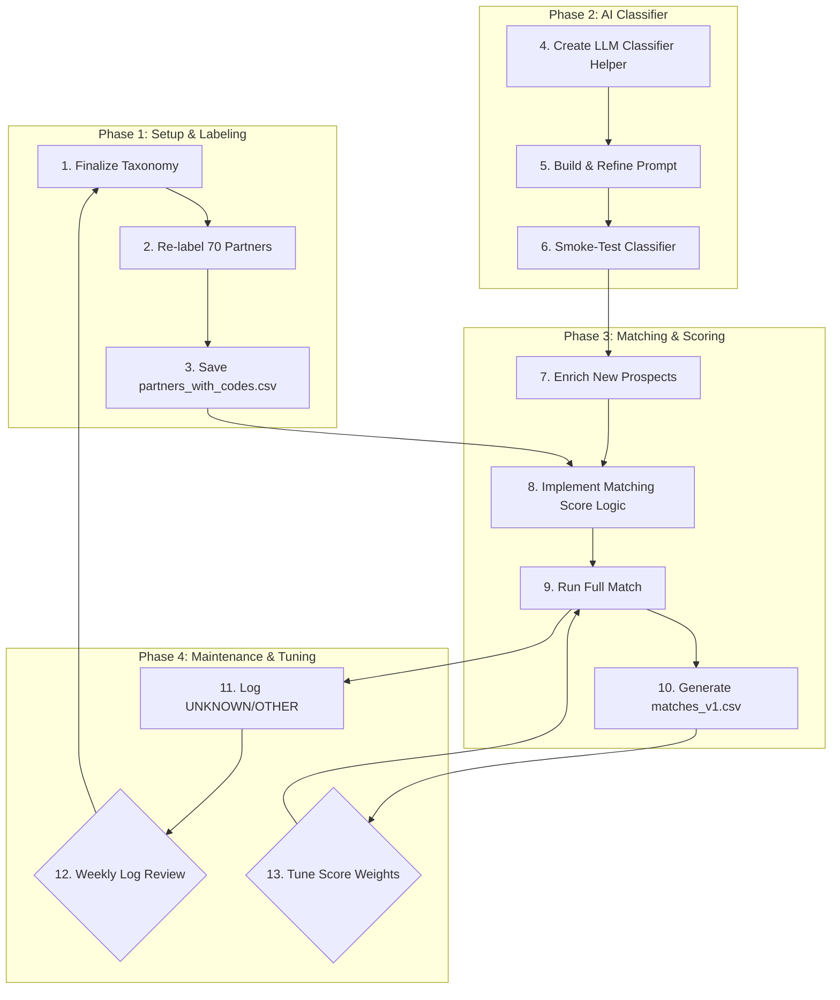

# Finalized Project Plan: v1 Prototype

This document outlines the approved plan for building the initial prototype of the AI-powered partner matching engine. We are proceeding with the "Prototype First" approach (Path A) to deliver a working version quickly, with the understanding that a more robust architecture (as detailed in `future_taxonomy_v2.md`) will be considered for a future release.

## Overall Workflow

## Step-by-Step Implementation

1.  **Update Taxonomy (`audience_taxonomy_v2025-06.json`):**
    *   Add `F_SALES`: "Functional Focus ► Sales / RevOps Departments".
    *   Add `F_OPS`: "Functional Focus ► Operations / Supply-Chain Teams".
    *   Confirm the `OTHER` code description is `"Audience ► Other / Not Yet Classified (manual explanation required)"`.

2.  **Re-label Partners:**
    *   Using the updated taxonomy, re-tag the 70 existing partner records.
    *   Save the output as `partners_with_codes.csv`.

3.  **Build Classifier (`classifier.py`):**
    *   Create the Python script `classifier.py`.
    *   Implement the `classify_blurb()` function skeleton.

4.  **Refine Prompt (in `classifier.py`):**
    *   Inside a `build_prompt()` function, ensure the prompt includes:
        *   The complete list of codes from the updated taxonomy.
        *   Few-shot examples for `X_HORIZ`, `F_HR`, and `X_SME`.
        *   Instructions to keep `temperature=0` and request JSON output: `{primary, secondary[], explain}`.

5.  **Test Classifier:**
    *   Run smoke tests using at least five well-known horizontal tools (e.g., Slack, Dropbox) and five niche vertical tools to validate the classifier's accuracy.

6.  **Enrich Prospects:**
    *   For each new prospect, obtain a short descriptive blurb.
    *   Run the `classify_blurb()` function on the blurb to generate and store the `audience_codes`.

7.  **Implement Scoring Logic:**
    *   Implement the `calculate_match_score()` function.
    *   Define the `SPECIAL` codes (all `X_*` and `F_*` codes).
    *   Define the `REGULATED_SET` (e.g., `{"FIN_*", "HC_*", "PUB_*"}`).

8.  **Run Full Match:**
    *   Load `partners_with_codes.csv` and the enriched prospect data.
    *   Loop through all prospect-partner pairs, calculate the match score, and determine the `overlap_type`.
    *   Save the top 5 partner matches for each prospect to `matches_v1.csv`.

9.  **Establish Maintenance Loop:**
    *   Implement logging to append any rows where the primary classification is `UNKNOWN` or `OTHER` to `unknown_log_2025-06.csv`.
    *   Establish a weekly process to review the log and the match quality, creating a feedback loop for tuning weights and potentially adding new taxonomy codes in the future.