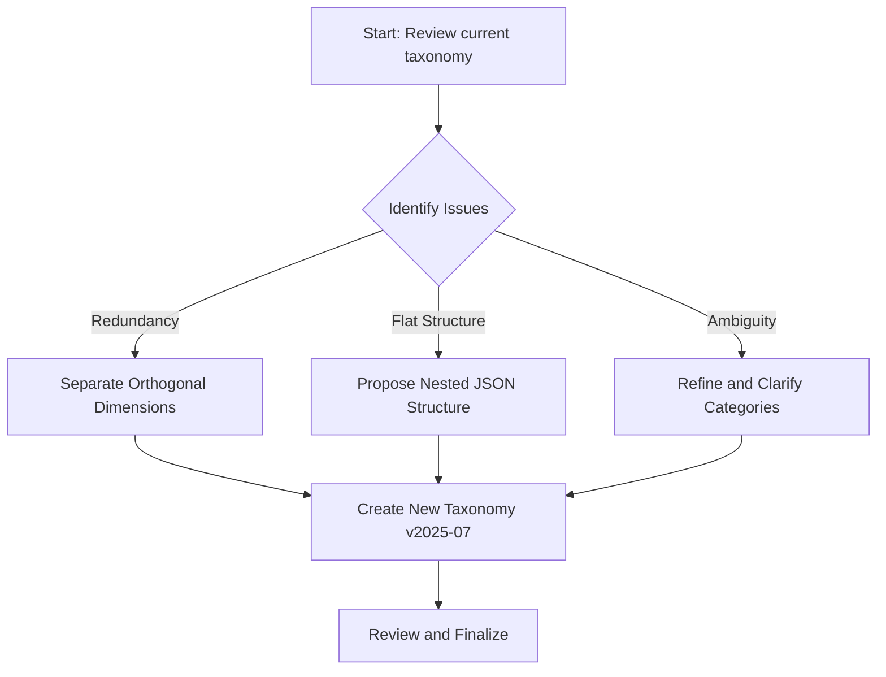

# Analysis and Improvement Plan for Audience Taxonomy

This document provides an analysis of the current `audience_taxonomy_v2025-06.json` and proposes a plan to create a more robust, scalable, and clear taxonomy.

## 1. Analysis of the Current Taxonomy

The existing taxonomy is a good starting point, with broad coverage across many key industries.

### Strengths
- **Wide Coverage:** It includes a comprehensive list of major industry verticals.
- **Clear Naming:** The descriptions are generally easy to understand.
- **Unique Keys:** Each entry has a unique key.

### Areas for Improvement
The primary challenge with the current structure is the mixing of several distinct classification types (we call these "orthogonal dimensions") into one flat list. This leads to several issues:

1.  **Redundancy and Overlap:**
    *   `TECH_IT` ("Technology ► Corporate IT Departments") and `F_IT` ("Functional Focus ► IT Departments") are duplicates. An IT department is a functional area that exists across many industries, not just the Technology sector.
    *   `RET_CPG` ("Retail ► Consumer-Packaged-Goods Brands") and `MFG_CPG` ("Manufacturing ► Consumer-Goods / CPG Producers") overlap. A CPG company can be both a manufacturer and a retailer.
2.  **Mixed Dimensions:** The taxonomy combines at least four different dimensions:
    *   **Industry Vertical:** (e.g., Healthcare, Finance, Manufacturing)
    *   **Functional Area:** (e.g., HR, IT, Finance, Marketing)
    *   **Company Size/Type:** (e.g., SME, Enterprise, Start-up)
    *   **Business Model:** (e.g., B2B SaaS, Marketplace, Regulated)
3.  **Limited Scalability:** The flat `KEY: "Category ► Subcategory"` string format is difficult to parse and extend. A nested structure would be more programmatically accessible and easier to manage.
4.  **Lack of Precision:** Because dimensions are mixed, you can't combine them. For example, you can't easily classify an audience as "IT Leaders" (`F_IT`) within "Large Enterprise Banks" (`FIN_BANK` + `X_ENTERPRISE`).

## 2. Proposed Improvement Plan

My recommendation is to restructure the taxonomy by separating these different dimensions into their own distinct categories. This will create a more flexible and powerful system where you can combine attributes to define an audience with much greater precision.

### The Plan



1.  **Restructure the JSON:** Move from a flat list to a nested JSON object. This makes the hierarchy explicit and easier for applications to consume.
2.  **Separate Dimensions:** Create distinct top-level objects for each dimension: `industry`, `functional_area`, `company_type`, and `business_model`.
3.  **Refine and Consolidate:**
    *   Remove duplicate entries (like the two IT department categories).
    *   Move functional roles (`F_HR`, `F_IT`, etc.) into the `functional_area` object.
    *   Move size-based (`X_SME`, `X_ENTERPRISE`) and other cross-industry categories into `company_type` or `business_model`.
    *   Ensure all descriptions are clear and definitions are mutually exclusive within their category.

### Example of the Proposed New Structure

Here is a snippet of what the new, restructured taxonomy could look like. Notice how you could combine `industry.Healthcare.HC_HOSP`, `functional_area.F_IT`, and `company_type.X_ENTERPRISE` to precisely target **IT leaders in enterprise-scale hospitals**.

```json
{
  "industry": {
    "Healthcare": {
      "HC_PC": "Primary-Care / General Practitioners",
      "HC_HOSP": "Acute-Care Hospitals",
      "HC_LTC": "Long-Term-Care / Nursing Homes",
      "...": "..."
    },
    "Financial-Services": {
      "FIN_BANK": "Retail & Commercial Banks",
      "FIN_INV": "Investment Banks / Asset Managers",
      "...": "..."
    },
    "...": {}
  },
  "functional_area": {
    "F_HR": "HR Departments",
    "F_IT": "IT Departments",
    "F_FIN": "Finance/Accounting Departments",
    "F_MKTG": "Marketing Departments"
  },
  "company_type": {
    "X_SME": "Small & Medium Enterprises (SME)",
    "X_ENTERPRISE": "Large Enterprises",
    "X_STARTUP": "Start-ups & Scale-ups",
    "X_NPO": "Non-Profits & NGOs"
  },
  "business_model": {
    "X_SAAS": "B2B SaaS",
    "X_MULTIPLATFORM": "Multi-Sided Platform/Marketplace",
    "X_REGULATED": "Serves Highly Regulated Sectors"
  },
  "meta": {
    "UNKNOWN": "Audience ► Unknown / Too little info",
    "OTHER": "Audience ► Other / Not Yet Classified"
  }
}
```

## 3. Next Steps

1.  **Review this plan.** Please let me know if you agree with this direction or if you have any modifications.
2.  **Approve the plan.**
3.  Once approved, I will switch to a different mode to implement these changes and create the new, restructured `audience_taxonomy_v2025-07.json` file.